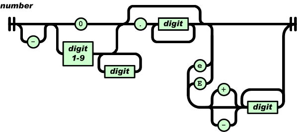

<!--
 * @Author: your name
 * @Date: 2021-03-30 17:34:46
 * @LastEditTime: 2021-03-31 16:12:55
 * @LastEditors: Please set LastEditors
 * @Description: In User Settings Edit
 * @FilePath: /mztknJson/doc/Parser.md
-->
# Parser设计思路

* [解析数字类型](##解析数字类型)

为了避免解析函数之间传递多个参数，我们把相关内容数据放入一个Context的结构体。注意这个类不负责构造和析构 json字符数组，仅作为private

```c++
    struct Context{
    public:
        const char *_json;
        explicit Context(char *json){
            assert(json!=NULL);
            _json = json;
        }
    };

```

## 解析数字类型

数字类型的语法：

```
number = [ "-" ] int [ frac ][ exp ]
int = "0" / digit1-9 *digit
frac = "." 1*digit
exp = ("e"/"E")["-"/"+"]1*digit
```

number以十进制表示，主要由4部分组成：负号、整数、小数、指数。只有整数是必须部分，正号是不合法的。
整数部分如果是0开始，只能是单个0；而由1-9开始，可以加任意数量的数字(0-9). `0123`不是一个合法的数字。
小数部分比较直观，就是小数点后面是1到多个数字(0-9)。
JSON可以使用科学计数法，指数部分由大or小写e开始，然后可有正负号。上述过程可由图表示：



### number存储的类型

之前的Null, true, false都可以直接保存为对应类型，但是数字我们需要考虑保存数数字的类型，简单起见，这里使用`double`来存储其类型

```c++
struct Value{
    double _n;
    ValueType _type;
}
```

当且仅当`_type == JSON_NUMBER`时，_n才表示数字，所以获取该值的API如下：

```c++
double Parser::get_number(const Value* v){
    assert(v!=NULL && v->type == JSON_NUMBER);
    return v->_n;
}
```

对应的我们也有一些测试用例。。。

### 十进制数转二进制double

这并不是一个容易的事情。可以参考RapidJson实现位于`rapidjson/reader.h 1468 - 1747行`。简单起见，这里首先使用标准库strtod().该函数可以转换JSON要求的格式；但是一些JSON不允许的格式，strtod()也可以转换
所以我们需要自行格式检验：

```c++
int parse_number(Context& c, Value* v){
    char* end;
    //TODO 检查是否合法
    v->n = strtod(c._json, &end);
    if(c._json == end){
        return PARSE_INVALID_VALUE;
    }
    c._json = end;
    v->type = JSON_NUMBER;
    return PARSE_OK;
}

```

## 解析字符串

JSON字符串与C语言相似，并且支持9种转义序列

~~~
string = quotation-mark *char quotation-mark
char = unescaped /
   escape (
       %x22 /          ; "    quotation mark  U+0022
       %x5C /          ; \    reverse solidus U+005C
       %x2F /          ; /    solidus         U+002F
       %x62 /          ; b    backspace       U+0008
       %x66 /          ; f    form feed       U+000C
       %x6E /          ; n    line feed       U+000A
       %x72 /          ; r    carriage return U+000D
       %x74 /          ; t    tab             U+0009
       %x75 4HEXDIG )  ; uXXXX                U+XXXX
escape = %x5C          ; \
quotation-mark = %x22  ; "
unescaped = %x20-21 / %x23-5B / %x5D-10FFFF
~~~

JSON字符串是由两个双引号夹着零个至多个字符。字符分为无转义字符或转义序列。转义序列有9种，都是以反斜杠开始。

### 字符串表示

在C语言种，字符串一般表示为空结尾字符传结尾，然而JSON字符串是允许含有空字符的，所以我们可以分配内存来存储解析后的字符，并记录字符的数目。由于大多数C程序都假设字符串是空结尾字符，我们还是在最后加上一个空字符。
所以我们在Value结构体种加入两个成员 `char* s; size_t len`;当然一个值不可能同时为数字和字符串，我们用union结构,注意这里需要使用c++11的新特性匿名union；所以编译时需要std=c++

```c++
struct Value{
    union{
        struct {char* s; size_t len; } _s;
        double _n;
    };
    ValueType _type;
}
```

### 内存管理
字符串的长度不是固定的，我们需要动态分配内存。简单期间，我们使用malloc()和free()来管理内存。当设置一个值为字符串时，我们需要把参数种的字符串复制一份：

```c++
void set_string(Value* v, const char* s, size_t len){
    assert(v != NULL && (s != NULL || len == 0));
    mztkn_free(v);
    v->_s = (char*)malloc(len+1);
    memcpy(v->_s, s, len);
    v->_s.s[len] = '\0';
    v->type = JSON_STRING;
}

```

在设置值之前需要将之前分配的内存释放，这里采用mztkn_free()函数：

```c++
void Free(Value* v){
    assert(v!=NULL);
    if(v->_type == JSON_STRING)
        free(v->_s);
    v->set_null();
}
```

### 缓冲区与堆栈

解析字符串（以及之后的数组、对象）时，需要把解析的结果先存储在一个临时的缓冲区，再用set_string()把缓冲区的结果设进值之中。

本文设计Parser 拥有成员变量Context 初始化Context时，初始化一定大小的栈（缓冲区）这个栈是以字节存储的，每次可要求压入任意大小的数据，它会返回数据起始的指针，压入时若空间不足，便以1.5倍大小扩展。栈的初始大小由宏 `PARSE_STACK_INIT_SIZE`确定

### 解析字符串

通过上述栈、清空等叙述，我们把解析字符串的任务分为以下几个步骤：
* 备份栈顶

* 把解析到的字符压栈

* 计算出长度，并一次性把所有字符弹出，在设置至value种。

以下是部分实现，没有处理转义和一些不合法字符的校验

```c++
static int parse_string(Context& c, Value* v){
    size_t head = c->top, len;
    const char* p;
    EXPECT(c, '\"');
    p = c._json;
    for(;;){
        char ch = *p++;
        switch(ch){
            case '\"':
                len = c->top - head;
            //...
        }
    }
}
```